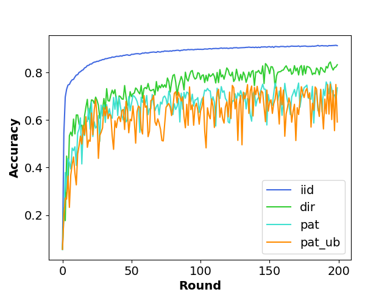
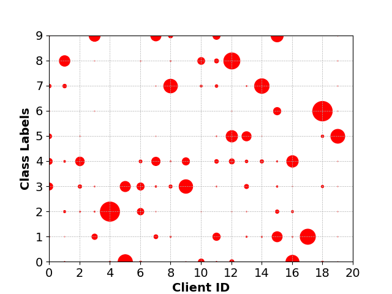

# LabPlotter
LabPlotter 是一个实验数据可视化工具，旨在帮助科研工作者轻松生成专业的图表，以便在论文和报告中展示实验结果。

## 说明
- 这个项目是我为了撰写论文而编写的，目的是快速生成机器学习的Accuracy和Loss曲线。目前支持PFLlib的h5形式和pFedLA的HTML文件，用户可以在read_data.py中编写自定义的读取函数，以支持更多数据格式。
- 支持单数据图和多数据图，同时，还可以根据json文件生成数据分布散度图。 

效果图展示：



## 安装
```bash
git clone https://github.com/R-16Bob/LabPlotter.git
cd LabPlotter
pip install -r requirements.txt
```

## 使用说明
### 数据准备
请将需要绘制的日志放在data目录，建议建立日期子目录以方便整理。
本项目使用read_data.py从日志文件中读取acc和loss列表，你可以自定义`read_data`函数以匹配你的日志格式。
### 单数据图
使用single_plot.py绘制单数据图，以观察某一次实验的结果。
只需要修改日志目录、日志文件名和迭代数量即可。
示例：
```python
    file_dir = '24-07-22/'
    file_name = 'FashionMNIST_FedAvg_cl20_iid.h5'
    epoch = 200
```
### 多数据图
使用plot.py绘制多数据图，以比较不同实验的结果。
将files列表修改为你的日志文件，并于laels和colors匹配，并设置储存位置和读取迭代数即可。默认提供了包含6种颜色的配色方案。
示例：
```python
    files = ['data/24-07-22/FashionMNIST_FedAvg_cl20_iid.h5',
             'data/24-07-22/FashionMNIST_FedAvg_cl20_dir.h5',
             'data/24-07-22/FashionMNIST_FedAvg_cl20_pat.h5',
             'data/24-07-22/FashionMNIST_FedAvg_cl20_pat_ub.h5',
             ]
    labels = ['iid', 'dir', 'pat','pat_ub']
    colors = default_colors
    save_name = 'plot/24-07-22/FashionMNIST_FedAvg_cl20'
    epochs = 200
```

### 数据分布图
使用data_plot.py绘制数据分布图。
只需要修改日志文件、class数量、保存位置即可。
示例：
```python
data_plot('gen_data/cifar10_cl20_pat.json', 10, 'gen_plot/24-10-09/data_cifar10_cl20_pat')
```
